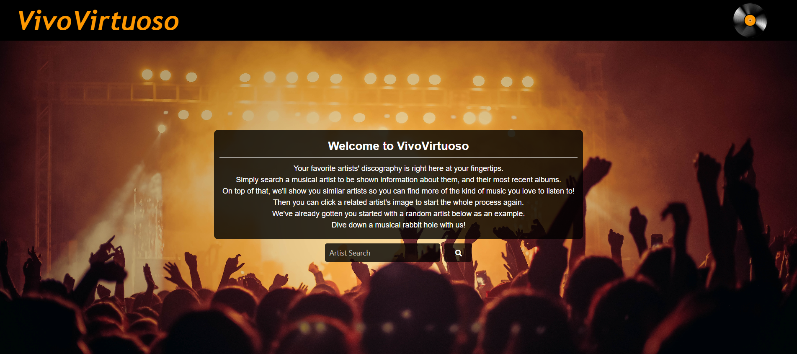
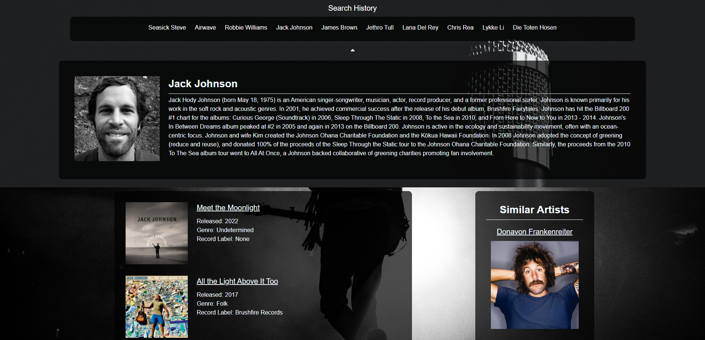
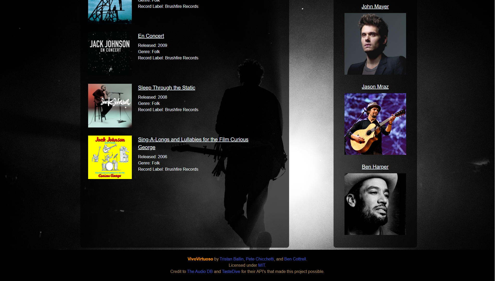

# VivoVirtuoso

## Description

VivoVirtuoso is a website that displays musical artist information, albums by that artist, and recommends similar artists to the user. It begins by offering a random artist as an example, and then has a search bar to find artists you want info on. You can also click on similar artists to do the same process over again. Random artists can also be loaded by clicking the vinyl record image.  

VivoVirtuoso utilizes Bulma as a CSS framework, drawing from [The Audio DB](https://www.theaudiodb.com) and [TasteDive](https://tastedive.com/read/api) API's. The Audio DB was used for artist and album info, and TasteDive was used for the recommendations of similar artists. 

Local storage was utilized to store the last 10 artists searched for. These are then appended to the page using javascript into a search history section. The albums of the artist are appended in order by most recent release. Clicking the AudioDB logo under the albums section brings you to that artist's Audio DB page. 

## Criteria

The following was the criteria laid out for this project:

```
Use a CSS framework other than Bootstrap.

Be deployed to GitHub Pages.

Be interactive (i.e: accept and respond to user input).

Use at least two server-side APIs.

Does not use alerts, confirms, or prompts (use modals).

Use client-side storage to store persistent data.

Be responsive.

Have a polished UI.

Have a clean repository that meets quality coding standards: 
(file structure, naming conventions, follows best practices for class/id-naming conventions, indentation, quality comments, etc.).

Have a quality README (with unique name, description, technologies used, screenshot, and link to deployed application).
```

## Link

[Application Link](https://thatballinguy.github.io/VivoVirtuoso/)

[Repository](https://github.com/ThatBallinGuy/VivoVirtuoso)

## Screenshots




## License

MIT License

Copyright (c) 2022 ThatBallinGuy, BenjaminCottrell, PeteChichetti

Permission is hereby granted, free of charge, to any person obtaining a copy
of this software and associated documentation files (the "Software"), to deal
in the Software without restriction, including without limitation the rights
to use, copy, modify, merge, publish, distribute, sublicense, and/or sell
copies of the Software, and to permit persons to whom the Software is
furnished to do so, subject to the following conditions:

The above copyright notice and this permission notice shall be included in all
copies or substantial portions of the Software.

THE SOFTWARE IS PROVIDED "AS IS", WITHOUT WARRANTY OF ANY KIND, EXPRESS OR
IMPLIED, INCLUDING BUT NOT LIMITED TO THE WARRANTIES OF MERCHANTABILITY,
FITNESS FOR A PARTICULAR PURPOSE AND NONINFRINGEMENT. IN NO EVENT SHALL THE
AUTHORS OR COPYRIGHT HOLDERS BE LIABLE FOR ANY CLAIM, DAMAGES OR OTHER
LIABILITY, WHETHER IN AN ACTION OF CONTRACT, TORT OR OTHERWISE, ARISING FROM,
OUT OF OR IN CONNECTION WITH THE SOFTWARE OR THE USE OR OTHER DEALINGS IN THE
SOFTWARE.
